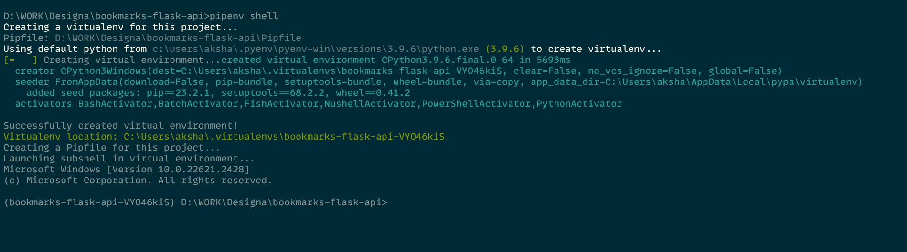

## Prerequisite Steps

1. Install Pyenv
Install PyEnv

to hvae multiple python version to manage clearly
https://www.dedicatedcore.com/blog/install-pyenv-ubuntu/

`pyenv install 3.9.6`


2. Install Pipenv
https://pipenv-es.readthedocs.io/es/stable/


## Setup the Repo

```bash

    pipenv shell                   # this is like oneline for create virtualenv and activate it one line
    pipenv install Flask           # without specifying version , pipenv takes correct version , later you can upate Pipfile.lock
    pipenv install                 # install all packages under packages section
    pipenv install --dev           # install all packages under dev packages something not part of deployable package


```




## Code with Me - step by step I created to reach current master

Always starts with pipenv shell

```bash
    pipenv shell
    pipenv install python-dotenv flask flask-sqlalchemy Flask-Migrate flask_validator psycopg2-binary   # look for Pipfile and Pipfile.lock files
    pipenv run flask run
    flask run

    flask db init
    flask db migrate
    flask db upgrade
```